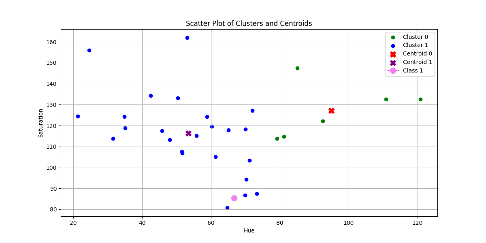
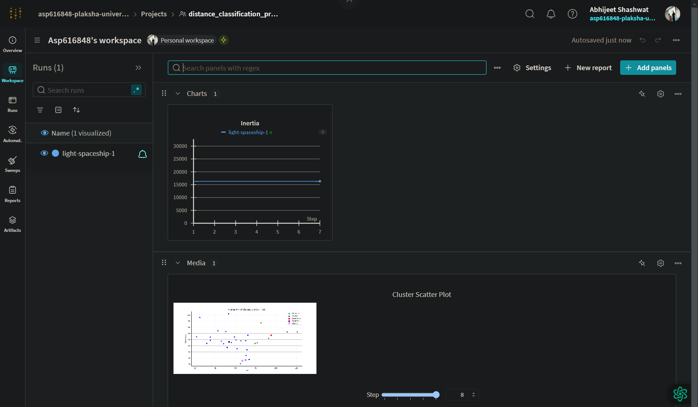
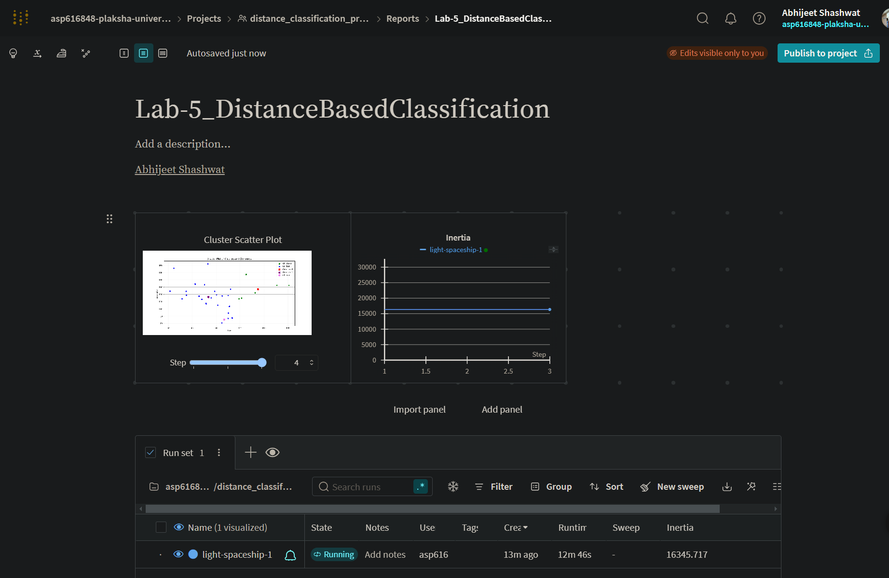

# Distance Based Classification
 This repository demonstrates distance-based classification techniques, applying algorithms like k-Nearest Neighbors to a dataset. It includes data preprocessing, performance evaluation, and visualizations of decision boundaries. Key features include accuracy analysis, metric comparison, and graphical representation of results. Built using Python, Scikit-learn, and Matplotlib.

## Overview
This project implements distance-based classification using various distance metrics while following best practices for version control, automation, containerization, and experiment tracking. The workflow incorporates tools such as Git, GitHub, GitHub Actions, Docker, Kaggle, and Weights & Biases (WandB).

## Project Setup
- A structured Git repository was initialized.
- A virtual environment was created, and dependencies were installed.
- A `.gitignore` file was added to exclude unnecessary files.
- The initial `distance_classification.py` script was developed.
- All necessary files were committed and pushed to GitHub.

## Automation with GitHub Actions
A GitHub Actions workflow was configured to:
- Run a test script upon each push.
- Verify that images and files load correctly in the Jupyter Notebook.

## Containerization with Docker
A `Dockerfile` was created to ensure a consistent environment across different machines. The container was built and run using the following commands:
```sh
docker build -t distance_based_classification .
docker run distance_based_classification
```

## Experimentation with Kaggle
Experiments were conducted in a Kaggle Notebook:
- Dependencies were installed.
- The dataset was processed and classified using distance-based methods.
- Plots and performance comparisons were generated.
- Final results were saved and exported.

## Tracking Results with WandB
Metrics and visualizations were logged using WandB. Key logs include:
```python
wandb.init(project='distance_classification_project')
wandb.log({"Metric Score": score})
wandb.log({"Output Image": wandb.Image(image)})
```
Below is an example of the model performance visualization:



### WandB Workspace


### WandB Project View


## Findings
- Different distance metrics yielded varying classification accuracies.
- Experiment tracking with WandB provided valuable insights into model performance.
- Automation and containerization ensured reproducibility and streamlined development.

## Faculty and Guest Speakers
### Plaksha Faculty


### Dr. Shashi Tharoor


## Future Improvements
- Implement additional distance metrics for comparison.
- Optimize model hyperparameters for better performance.
- Expand dataset preprocessing techniques.

## Submission Details
The GitHub repository contains:
- Completed Jupyter Notebook.
- `Dockerfile` for containerization.
- GitHub Actions workflow script for automation.
- Experiment logs and visualizations.

## Links
- [GitHub Actions Documentation](https://github.com/asp616848/Distance-Based-Classification)
- [Kaggle Link for notebook](https://www.kaggle.com/code/asp616848/distance-based-classification)