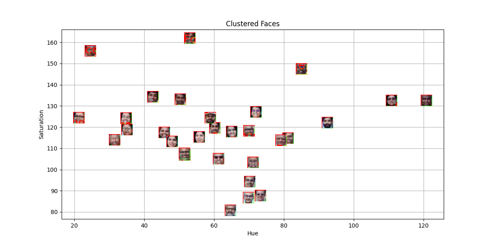
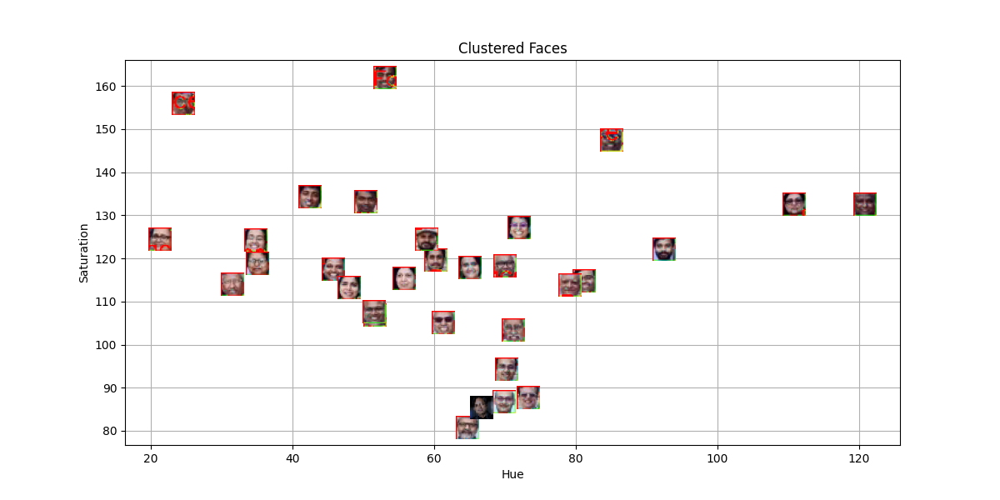

# Distance Based Classification
 This repository demonstrates distance-based classification techniques, applying algorithms like k-Nearest Neighbors to a dataset. It includes data preprocessing, performance evaluation, and visualizations of decision boundaries. Key features include accuracy analysis, metric comparison, and graphical representation of results. Built using Python, Scikit-learn, and Matplotlib.

## Overview
This project implements distance-based classification using various distance metrics while following best practices for version control, automation, containerization, and experiment tracking. The workflow incorporates tools such as Git, GitHub, GitHub Actions, Docker, Kaggle, and Weights & Biases (WandB).

## Project Setup
- A structured Git repository was initialized.
- A virtual environment was created, and dependencies were installed.
- A `.gitignore` file was added to exclude unnecessary files.
- The initial `distance_classification.py` script was developed.
- All necessary files were committed and pushed to GitHub.

## Automation with GitHub Actions
A GitHub Actions workflow was configured to:
- Run a test script upon each push.
- Verify that images and files load correctly in the Jupyter Notebook.

## Containerization with Docker
A `Dockerfile` was created to ensure a consistent environment across different machines. The container was built and run using the following commands:
```sh
docker build -t distance_based_classification .
docker run distance_based_classification
```

## Experimentation with Kaggle
Experiments were conducted in a Kaggle Notebook:
- Dependencies were installed.
- The dataset was processed and classified using distance-based methods.
- Plots and performance comparisons were generated.
- Final results were saved and exported.

## Tracking Results with WandB
Metrics and visualizations were logged using WandB. Key logs include:
```python
wandb.init(project='distance_classification_project')
wandb.log({"Metric Score": score})
wandb.log({"Output Image": wandb.Image(image)})
```
Below is an example of the model performance visualization:


### WandB Workspace


### WandB Project View


### Plot without template image


### Plot after adding template image


## Findings
- Different distance metrics yielded varying classification accuracies.
- Experiment tracking with WandB provided valuable insights into model performance.
- Automation and containerization ensured reproducibility and streamlined development.

## Faculty and Guest Speakers
### Plaksha Faculty


### Dr. Shashi Tharoor


## Future Improvements
- Implement additional distance metrics for comparison.
- Optimize model hyperparameters for better performance.
- Expand dataset preprocessing techniques.

## Submission Details
The GitHub repository contains:
- Completed Jupyter Notebook.
- `Dockerfile` for containerization.
- GitHub Actions workflow script for automation.
- Experiment logs and visualizations.

## Links
- [GitHub Actions Documentation](https://github.com/asp616848/Distance-Based-Classification)
- [Kaggle Link for notebook](https://www.kaggle.com/code/asp616848/distance-based-classification)


## Report

#### 1. What are the common distance metrics used in distance-based classification algorithms? 
Common distance measures - Euclidean, Manhattan, Minkowski, Chebyshev and Hamming distances - are employed for distance-based classification algorithms.
Euclidean distances are expressed in the units of the length between the points [((x2-x1)^2 + (y2-y1)^2)^(1/2)] , while Manhattan distances are expressed in the units of the sum of the absolute differences in dimensions.
Minkowski generalizes Euclidean and Manhattan to an arbitrarily parameterized and parametrized weighted sum as well as gives a genral equation for other distance metrics.
Chebyshev(greatest difference along any axis) and Hamming quantify the largest amplitude of coordinate difference (Chebyshev and the symbol difference (Hamming) of categorical data, respectively). 


#### 2. What are some real-world applications of distance-based classification algorithms? 
Distance-based learning algorithms are one of the applications into real world implementation which have been observed outside of the fields of image-based, character-based handwriting based recognition, and document-based classification, etc. These algorithms are used for medical diagnosis and fraudulent transaction detection, both of which can be understood as the similarity between patient data and the similarity between transaction patterns, respectively. These allow, among other things, the goal of what the users would like, the detection of anomalies, clustering similar data-points, natural language recognition, and natural language processing. Additionally, distance-sensitive approaches are employed as such in the fields of clustering, segmentation, and pattern recognition, where they are effectively applied for decision making in research-related applications and industrial applications.

#### 3. Explain various distance metrics. 
- **Euclidean Distance:**  
  Calculates the straight-line distance between two points.  
  \[
  d(x, y) = sqrt( sum[i=1 to n] (x_i - y_i)^2 )
  \]

- **Manhattan Distance:**  
  Sum of the absolute differences.  
  \[
  d(x, y) = sum[i=1 to n] |x_i - y_i|
  \]

- **Minkowski Distance:**  
  Generalized form with parameter \(p\).  
  \[
  d(x, y) = ( sum[i=1 to n] |x_i - y_i|^p )^(1/p)
  \]

- **Chebyshev Distance:**  
  Maximum absolute difference among dimensions.  
  \[
  d(x, y) = max(|x_i - y_i|) for all i
  \]
  
- **Cosine Similarity:**  
  Measures the cosine of the angle between two vectors.  
  \[
  sim(x, y) = (x · y) / (||x|| * ||y||)
  \]

- **Hamming Distance:**  
  Counts the number of differing symbols.  
  \[
    d(x, y) = count of positions where x_i ≠ y_i
  \]

#### 4. What is the role of cross validation in model performance? 
Cross Validation is a powerful technique for estimating model performance and to prevent overfitting unseen data. It divides the dataset into several folds, and alternatively treats each fold as a test set, and uses the other folds for training. This iterative process minimizes over fitting, provides some point of confidence in terms of estimating accuracy and helps with hyperparameter tuning and model selection. In general, cross validation yields an unbiased assessment of a model's ability to get an estimate of future cases (non-trivial task, given the complex nature of real-world data) and thus guarantees robustness, reproducibility, and effectiveness of the model in the real world (non-trivial task, given the complex nature of real-world data). In practice, it enhances model trustworthiness.

#### 5. Explain variance and bias in terms of KNN? 
Bias refers to the oversimplified assumptions of KNN, and variance refers to the sensitivity to the randomness of the training data. Ideally, a low bias model, i.e., the KNN with a small k value, should be similar to the training data but may have high variance and overfitting. On the contrary, with a more prevalent k, variance is diminished but bias is amplified, leading to oversimplifying the decision boundary. The bias-variance trade-off of KNN is a problem whose optimal value of k, with both flexibility and stability, needs to be picked so that the generalization performance on unseen, novel, samples is maximized, i.e., harmony. Large K produces smoother boundaries
but if K is too large, the algorithm will always predict the majority class; conversly small k makes boundaries sharper and with too small K it will account for noise as well.